# Test Generator API Backend
This project was create to help people to study. It is also good to make a simple quiz for fun.

this app is used in https://mpapi.networkmanager.pl/

## Table of Contents
* [General Info](#general-information)
* [Technologies Used](#technologies-used)
* [Features](#features)
* [Setup](#setup)
* [Usage](#usage)
* [Api](#api-request)
* [Acknowledgements](#acknowledgements)
* [Contact](#contact)

## General Information
This project was create to help study to exam in school but it is also good to did simple quiz and have fun with friends.

The purpose is fast and enjoyable study base on question and answer and solve test

I did this because someone asked me to create app to study for exam.
It is also a credit project in MegaK course.

## Technologies Used
- Typescript - version 4.7
- Node JS - version 17.0
- Express - version 4.18
- Passport JS - version 0.6
- Passport-local - version 1.0
- Mysql2 - version 2.3
- Cors - version 2.8
- Jest

## Features
- authorization and authentication user by passport JS
- hashed a password of user
- possibility to add new question by user. if questions have only correct answer they don't be use in quiz. Only questions with 2 or more answer cen by used in quiz
- possibility to get all question and get all question from module
- possibility to generate exam and exam from module with specific number of question
- shuffle answer in questions exam
- shared types with frontend

## Setup
create data base:
use file database.sql

create file configData.ts in folder ConfigData based on configDataTemplate.ts to configure database, session and cors data

I recommend open this app in http://localhost:3001 to be compatible with the frontend.

npm install

npm start

## Usage
This api is collaborate with TestGenerator-frontend API Link here:
https://github.com/ItachiPM/TestGenerator-front

## Api Request 

- Login
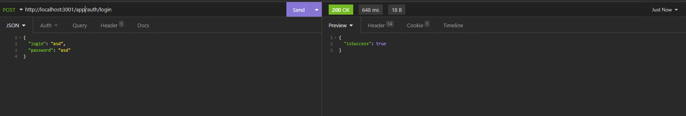
- Logout
  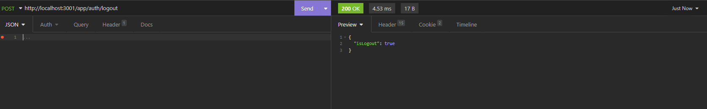
- Register
  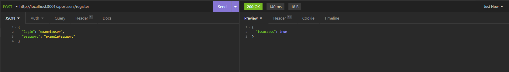
- Delete user
  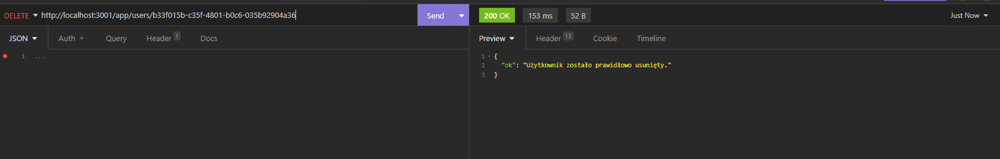
- Search user
  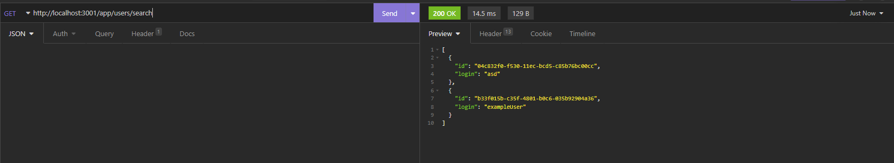
- Test generate
  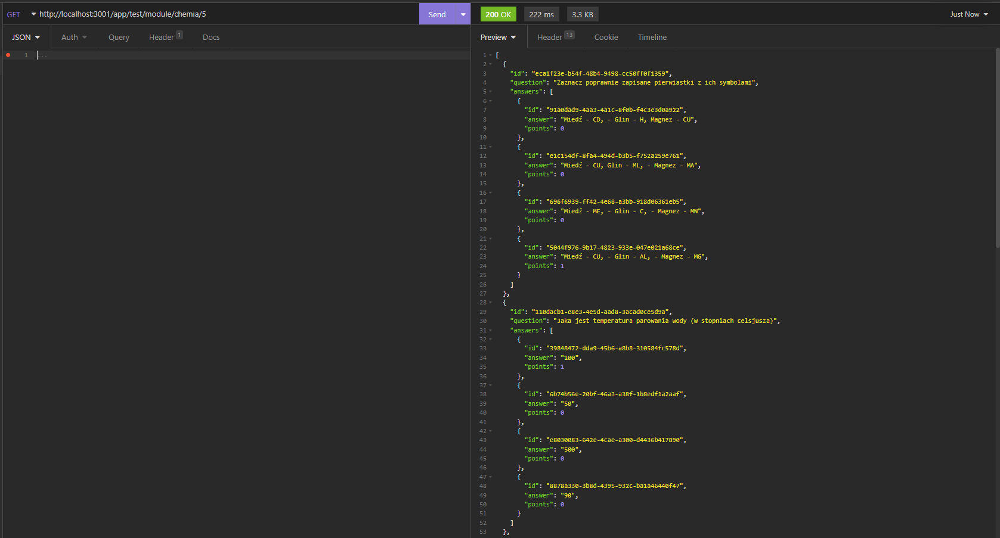
- Modules
  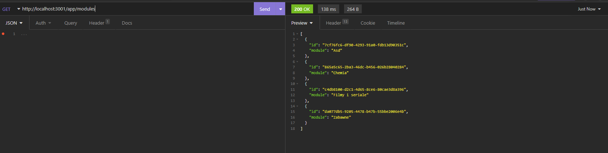
- Question
  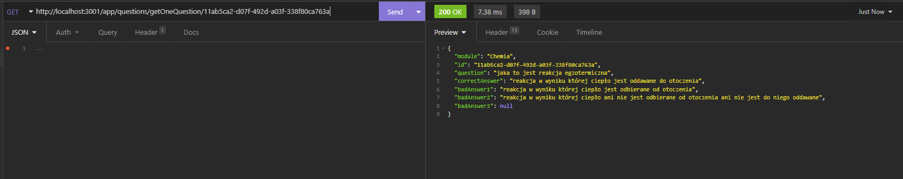
- Question By module
  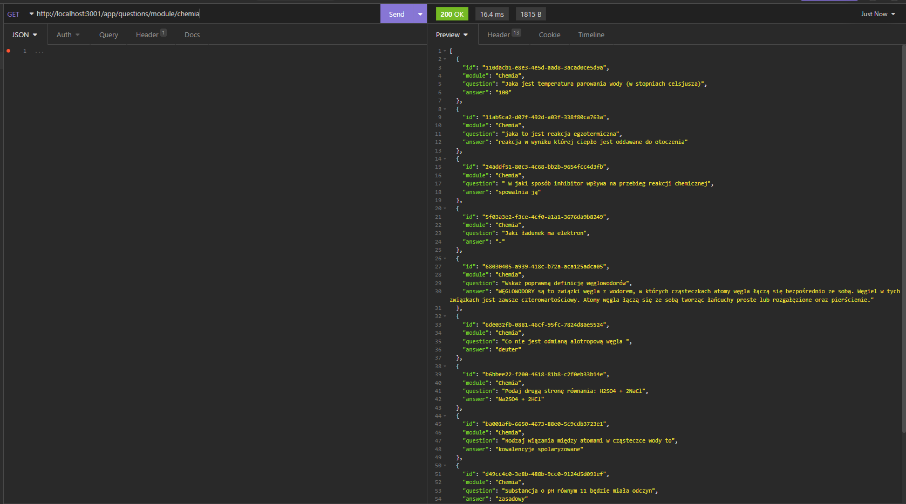
- Questions
  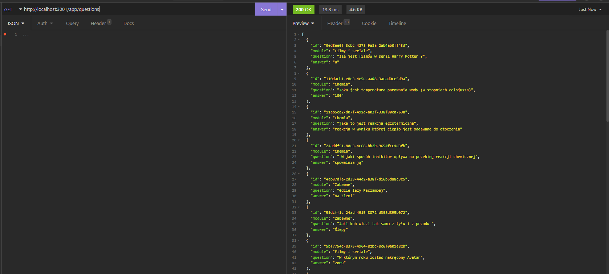
- Question to Admin panel
  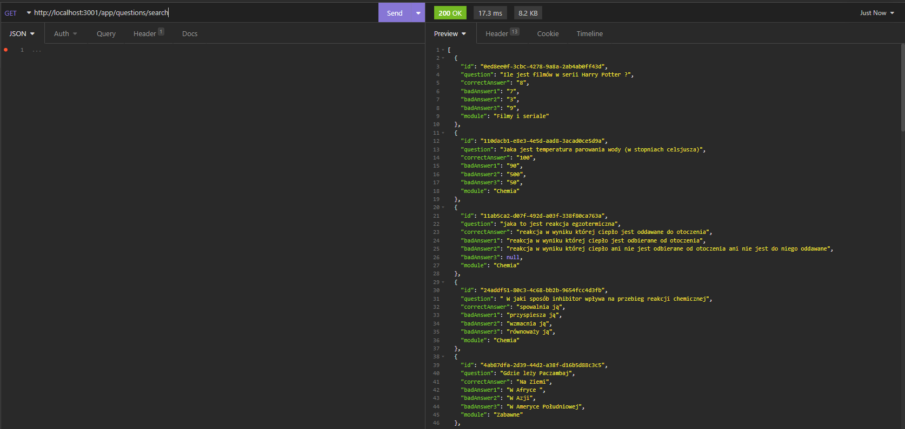
- Add question
  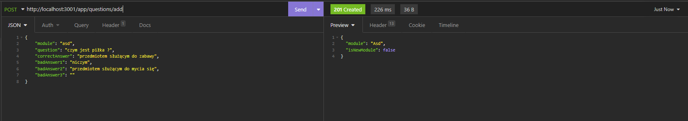
- Delete question
  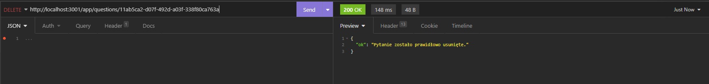

## Acknowledgements
This project was created on base knowledge gained on MegaK course.

## Contact
michal.pietraszek98@gmail.com
